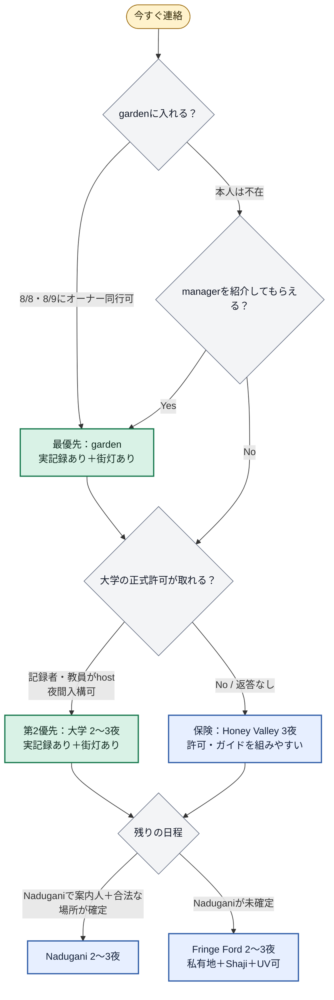

# インド遠征：これだけ見ればよい図



## 優先順位

```text
1. garden   ：実際の観測記録＋街灯あり
2. 大学     ：実際の観測記録＋街灯あり
3. Honey Valley：上の許可が取れない場合の確実な保険
4. Nadugani ：記録根拠は強いが、現地の人と合法な観察場所が未確定
5. Fringe Ford：対象種記録は弱いが、観察を実行しやすい
```

## 今日送る連絡は3件だけ

```text
garden → 8/8か8/9に訪問できるか。不在ならmanagerを紹介してほしい
大学   → 記録者／教員に、18～22時の入構と記録街灯の案内を依頼
Honey Valley → 上の返事待ちなので、変更可能な3泊だけ仮押さえ
```

## 車

```text
自走レンタカーは借りない
→ 訪問先が確定してから、空港送迎＋地点間移動を運転手付きで予約
```

判断期限は **8月2日夜**。gardenと大学のどちらかから許可が取れたら、そこを中心に国内線・宿・車を決める。
