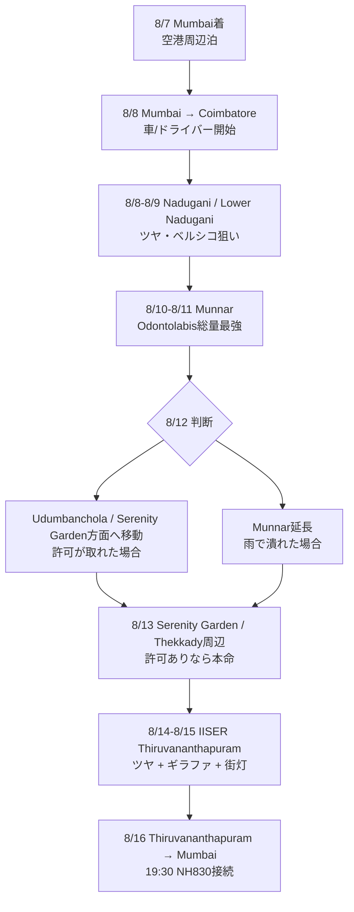
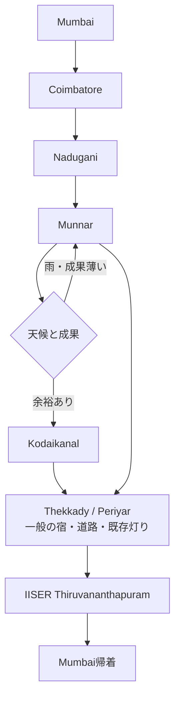

# インド虫ポイント巡回ルート案

## 前提

- 国際線は 2026-08-07 17:50 ムンバイ着、2026-08-16 19:30 ムンバイ発。
- 実質使えるのは 8/8 から 8/16 昼前後まで。
- 主目的はツヤ系。ギラファ単独地点は後回しでよかったが、IISER Thiruvananthapuram でもツヤが見れていて街灯も期待できるため、優先度を上げる。
- 8月の西ガーツはモンスーン期なので、山道の通行止め・落石・視界不良を前提に、夜間の長距離移動は避ける。

## 優先順位

1. ムンナル - テッカディ/ペリヤール - コダイカナル帯
   - iNaturalistの80km圏ではOdontolabisが最も濃い。
   - ムンナル: Odontolabis 51件。内訳は O. burmeisteri 23、O. delesserti 16、O. versicolor 6。
   - コダイカナル: Odontolabis 40件。内訳は O. burmeisteri 19、O. delesserti 13、O. versicolor 2。
   - テッカディ/ペリヤール: Odontolabis 44件。内訳は O. burmeisteri 18、O. delesserti 13、O. versicolor 7。
   - Serenity Gardenと思われるSeema Merchantさんの記録もIdukki/Udumbanchola周辺にまとまっており、この帯に含めて考える。
   - 「ツヤだけ」を見るなら、この帯が最優先。

2. IISER Thiruvananthapuram 周辺
   - ギラファに加えてツヤも見れている。
   - 街灯がある可能性が高く、夜の確認効率がよさそう。
   - iNaturalistの80km圏ではOdontolabisは6件と多くないが、O. versicolor 4、O. burmeisteri 2があり、Prosopocoilus girafa 14、Hexarthrius davisoni 3もある。
   - ツヤ単独ではムンナル帯に負けるが、ツヤ + ギラファ + ダビソン系の複合ポイントとして強い。
   - 終盤に2夜置く価値あり。

3. ナドゥガーニ
   - メモ: ブルマイ、ベルシコ。
   - コインバトールから入りやすく、南インドルートの起点として合理的。
   - iNaturalistの80km圏ではOdontolabis 11件。内訳は O. delesserti 9、O. burmeisteri 2。
   - BE-KUWA/ロウワーナドゥガニ情報を考えると、iNaturalistの件数以上に実地価値がある。特に「Lower Nadugani」寄りの低めの峠道・集落・街灯を優先して見る。

4. ラニプラム、マディケーリ、タディヤンダモル
   - iNaturalistではOdontolabisがかなり強い。
   - ラニプラム: Odontolabis 25件。O. burmeisteri 21、O. versicolor 2、O. delesserti 1。
   - マディケーリ/タディヤンダモル: Odontolabis 26件前後。O. burmeisteri 21、O. delesserti 2、O. versicolor 2。
   - ただし今回の南端IISERルートと同時に入れると移動が壊れる。今回は別案/予備扱い。

5. チクマガルル
   - 今回は距離が重い。
   - iNaturalistではOdontolabis 6件で全てO. burmeisteri。Prosopocoilusは多い。
   - 北部西ガーツ案を採るなら候補だが、今回の主軸からは外す。

## iNaturalist対応表

集計条件: 各CSV/候補地点の中心から半径80km、iNaturalist API、2026-07-03時点。観察地点は秘匿・粗精度の場合があるので「ピンそのもの」ではなく「同じ山塊/移動圏での濃さ」として見る。

| CSV/候補地点 | CSVメモ | iNaturalist上の主な対応 | 評価 |
| --- | --- | --- | --- |
| ナドゥガーニ | ブルマイ、ベルシコ | Odontolabis 11: O. delesserti 9、O. burmeisteri 2。Prosopocoilus girafa 5、Hexarthrius davisoni 1。 | BE-KUWAのロウワーナドゥガニ情報を加味して実地優先度高。件数は少なめだが、場所の具体性が強い。 |
| ムンナル / Munnar iwa | ブルマイスター | Odontolabis 51: O. burmeisteri 23、O. delesserti 16、O. versicolor 6。Hexarthrius davisoni 10。 | ツヤ本命。件数・種数とも強い。 |
| コダイカナル / Mountain View kodaikanal / shola heaven resort | ブルマイスター | Odontolabis 40: O. burmeisteri 19、O. delesserti 13、O. versicolor 2。Hexarthrius davisoni 10。 | ムンナルに次ぐ本命。IISER2夜を守るため1夜が基本。 |
| KTDC ペリヤー・ハウス / テッカディ | 中継/保険 | Odontolabis 44: O. burmeisteri 18、O. delesserti 13、O. versicolor 7。Hexarthrius davisoni 10。 | ツヤ密度はかなり高い。ムンナルからIISERへ抜ける途中で1夜入れる価値あり。 |
| Serenity Garden / Seema Merchant観察地 | 私有地/要許可 | Seemaさんの公開Lucanidae記録はIdukki/Udumbanchola周辺に集中。O. delesserti、O. burmeisteri、Prosopocoilus speciosusなど。 | もし本人から許可・案内が得られるなら、テッカディ枠をここに寄せる。許可なしなら近づきすぎず、一般の宿・道路・既存灯りに留める。 |
| IISER Thiruvananthapuram | ギラファ、ツヤも確認 | Odontolabis 6: O. versicolor 4、O. burmeisteri 2。Prosopocoilus girafa 14、Prosopocoilus speciosus 4、Hexarthrius davisoni 3。 | ツヤ件数は多くないが、街灯・ギラファ・ツヤ確認済みの複合点。2夜置く。 |
| ラニプラム一帯 | 宿候補多数 | Odontolabis 25: O. burmeisteri 21、O. versicolor 2、O. delesserti 1。Prosopocoilusも多い。 | 虫だけなら強いが、今回の南端ルートと両立しにくい。別案向き。 |
| マディケーリ / タディヤンダモル | 北部西ガーツ | Odontolabis 26前後: O. burmeisteri 21、O. delesserti 2、O. versicolor 2。 | 強い。ただし北に寄りすぎる。 |
| チクマガルル | 北部西ガーツ | Odontolabis 6: O. burmeisteri 6。Prosopocoilus girafa 10。 | Prosopocoilus寄り。今回の主目的では優先度低め。 |

## BE-KUWA/ロウワーナドゥガニの読み

- Webで確認できる公開情報として、BE-KUWA 90号は「世界のツヤクワガタ大特集」（2024-01-23発売）で、Odontolabisを見るうえで参照価値が高い。
- ユーザー情報の「ロウワーナドゥガニ」は、iNaturalistの広域件数だけでは拾いにくいピン精度の情報として扱う。
- したがってナドゥガーニは、iNaturalistのOdontolabis件数だけならムンナル/テッカディより下だが、実地では初手で踏む価値がある。
- 見るなら「Nadugani」中心だけでなく、Lower Nadugani寄りの標高が少し下がる道路、集落、街灯、林縁を夜に確認する。
- ただし2夜以上粘ると、iNaturalist上で明確に濃いムンナル/テッカディ帯とIISER2夜を削るので、基本はナドゥガーニ2夜まで。

## 8月の見やすさ

集計条件: iNaturalistのLucanidae観察を各地点80km圏で取得し、観察月で集計。件数は観察者の偏り、秘匿座標、観光地偏りを受けるので、絶対数ではなく「8月に出ているか」「7-9月のモンスーン期に出ているか」を見る。

| 地点 | 8月のOdontolabis | 7-9月のOdontolabis | 8月に強そうな虫 | 8月評価 |
| --- | ---: | ---: | --- | --- |
| ナドゥガーニ | 1 | 5 | O. delessertiは8月あり。O. burmeisteriは8月記録なし。Prosopocoilusは7/9月寄り。 | 中。Lower Nadugani情報込みで初手価値あり。ただし8月だけを見ると爆発力は不明。 |
| ムンナル | 1 | 9 | O. delessertiは8月あり。Hexarthrius davisoniは8月2件。O. burmeisteriは7/9月あり、8月なし。 | 中-高。8月ピンポイントより、周辺月を含めた山塊の強さで評価。雨で潰れたら粘る価値あり。 |
| コダイカナル | 1 | 9 | O. delessertiは8月あり。Hexarthrius davisoniは8月2件。O. burmeisteriは7/9月あり、8月なし。 | 中-高。ムンナルと似た傾向。1夜は踏みたいが、IISER2夜を削るほどではない。 |
| テッカディ/ペリヤール | 1 | 5 | O. delessertiは8月あり。Hexarthrius davisoniは8月2件。O. burmeisteriは9月寄り。 | 中。中継ではなく1夜の価値あり。 |
| Serenity Garden / Seema Merchant観察地 | 0 | 1 | Seemaさん自身の公開記録では5月、7月、10-11月が中心。8月記録は未確認。ただし周辺80kmのテッカディ/ペリヤールでは8月Odontolabisあり。 | 中。8月データだけなら決め手は弱いが、本人案内・既存灯り・私有地許可が得られるなら実地価値は高い。 |
| IISER Thiruvananthapuram | 2 | 3 | O. burmeisteri 8月1、O. versicolor 8月1。Prosopocoilus 8月2、P. speciosus 8月1。 | 高。件数は少ないが、今回の日付との相性がよい。2夜置く理由が強くなった。 |
| ラニプラム | 1 | 4 | O. burmeisteri 8月1。Prosopocoilus 8月2、9月多め。 | 中。虫は強いが、今回ルートでは遠い。 |
| マディケーリ/タディヤンダモル | 1 | 5 | O. burmeisteri 8月1。Prosopocoilus 8月2、9月多め。 | 中。北部案ならあり。今回は切る。 |
| チクマガルル | 0 | 0 | Prosopocoilusは8月3。O. burmeisteriは10/12月寄り。 | 低。8月ツヤ狙いでは弱い。 |

### 種別の読み

- O. burmeisteri:
  - iNaturalist上では8月が強い種というより、地点によって春、秋、冬にも散る。
  - 8月実記録があるのはIISER、ラニプラム、マディケーリ/タディヤンダモル。ムンナル/コダイカナル/テッカディは7月・9月にはあるが8月は拾えなかった。
  - ただし記録数の少なさと観察者偏りが大きいので、8月に出ないとは読まない。街灯と雨上がりを重視。

- O. versicolor:
  - IISERでは8月実記録あり。今回IISERの優先度を上げる強い材料。
  - ムンナル/テッカディ/コダイカナルでは記録はあるが、8月には出ていない。

- O. delesserti:
  - ナドゥガーニ、ムンナル、コダイカナル、テッカディで8月実記録あり。
  - 8月にツヤ属を見たいという観点では、実はこの種が最も月相性を支えている。

- Prosopocoilus girafa / Prosopocoilus類:
  - IISERはProsopocoilusが8月にも出ており、P. girafa全体の件数も多い。
  - ギラファ狙いを兼ねるならIISER2夜はかなり合理的。

- Hexarthrius davisoni:
  - ムンナル、コダイカナル、テッカディでは8月に2件ずつ出ている。
  - IISERでは同圏内に記録はあるが、8月ではなく3-5月寄り。

### 8月評価を反映した夜の配分

- 8/8-8/9: ナドゥガーニ2夜。Lower Nadugani情報を信じて踏む。ただし3夜目は基本なし。
- 8/10-8/11: ムンナル2夜相当。Odontolabis総量が最強で、8月のO. delesserti/Hexarthriusもある。
- 8/12: Serenity Garden/Udumbanchola/Thekkady方面へ移動。Seemaさん許可が取れた場合に備えて早めに寄せる。
- 8/13: Serenity Gardenまたはテッカディ/ペリヤール1夜。O. delessertiとHexarthriusの8月記録があり、中継以上の価値。
- 8/14-8/15: IISER2夜。O. burmeisteri、O. versicolor、Prosopocoilusが8月に出ているので、今回の日程との相性が最もよい。

## 基本ルート

ムンバイ → 国内線でコインバトール → ナドゥガーニ → ムンナル → Serenity Gardenまたはテッカディ/ペリヤール → IISER Thiruvananthapuram → 国内線でムンバイ

車はコインバトール空港で借りる、または運転手付き車を手配する。2人旅なら、費用と疲労のバランスを考えても運転手付き車がかなり有力。

## ルート図

### 本命案: Serenity Gardenの許可/案内が取れた場合



### 予備案: Serenity Gardenの許可が取れない場合



ASCIIで見ると:

```text
Mumbai
  |
  | domestic flight
  v
Coimbatore
  |
  v
Nadugani / Lower Nadugani  -- 2 nights
  |
  v
Munnar                    -- 2 nights or 1.5 nights
  |
  v
Serenity Garden / Thekkady -- permission-based fork
  |
  v
IISER Thiruvananthapuram  -- 2 nights
  |
  | domestic flight
  v
Mumbai
```

## Serenity Gardenの扱い

- Seema MerchantさんのiNaturalist公開記録を見る限り、Lucanidae観察はIdukki/Udumbanchola周辺にまとまっている。
- 種は O. delesserti、O. burmeisteri、Prosopocoilus speciosus など。
- 位置は公開観察に出ているが、私有地の可能性が高いので、このメモでは詳細座標を再掲しない。
- 許可が取れた場合だけ、8/13のテッカディ/ペリヤール枠を Serenity Garden 寄りにする。
- 許可が取れない場合は、そこを目的地化しない。近隣の一般宿、道路沿い、既存灯り、合法的に入れる場所に留める。
- 最初の連絡では「写真のみ」「非接触」「既存の灯り」「許可がある場合のみ」を強調し、ライトトラップという言葉は出さない。
- もしガイド/自然観察案内が成立したら、費用を払ってその人のルールに従うのが最も安全で、情報の質も高い。

## 交通詳細・実行ダイヤ

調査日: 2026-07-03。航空・バス・レンタカーは変わるので、予約直前に公式サイト/アプリで再確認する。ここでは「現時点で実際に組めそうな便と時刻」を使って、虫の夜を守れる行程だけを本線にする。

### 交通の結論

本線は「国内線 + コインバトール空港発の運転手付き車 + トリヴァンドラム空港終了」。

- バスは昼移動には使えるが、夜の観察・雨天時の逃げ・荷物・ポイント微調整に弱い。
- 自走レンタカーはCoimbatoreでは本当に借りられそう。ただしThiruvananthapuram返却が不確実で、返却のためにCoimbatoreへ戻るとIISER2夜が壊れる。
- バイクはCoimbatoreでもMunnarでも借りられそうだが、8月の西ガーツを2人+大リュックで長距離走るのは危険寄り。昼の近距離下見用ならあり、全行程の主交通にはしない。

### 推奨ダイヤ: 運転手付き車

| 日付 | 区間 | 交通 | 推奨時刻 | 備考 |
| --- | --- | --- | --- | --- |
| 8/7 Fri | 伊丹 → 羽田 → 成田 → Mumbai | 既存国際線 | BOM 17:50着 | ムンバイ空港周辺泊。国内線乗継はしない。 |
| 8/8 Sat | Mumbai → Coimbatore | 国内線 | IndiGo直行 09:10 → 11:00目安 | IndiGoはBOM-CJB直行が約1:45-1:50、最早09:10発の記載あり。Air Indiaも直行3本/日、初便05:10、最終18:45の記載あり。 |
| 8/8 Sat | CJB空港 → Nadugani/Lower Nadugani | 運転手付き車 | 11:45発 → 17:30前後着 | 約160km級。Ooty/Gudalur方面の山道。雨期は5-6時間を見る。夜は宿周辺・既存灯り。 |
| 8/9 Sun | Nadugani周辺 | 同じ車 | 日中下見、夜観察 | Lower Nadugani寄りの既存灯り・安全に停められる場所を昼に確認。 |
| 8/10 Mon | Nadugani → Munnar | 同じ車 | 07:30発 → 16:30-18:00着 | 今回最大級の移動。Coimbatore/Pollachi/Udumalpet/Marayoor経由想定。雨期は8-10時間見て、夜は軽め。 |
| 8/11 Tue | Munnar周辺 | 同じ車 | 日中下見、夜観察 | 今回のOdontolabis総量最強帯。ここは削らない。 |
| 8/12 Wed | Munnar → Udumbanchola/Serenity Garden周辺 | 同じ車 | 10:00発 → 13:00-14:00着 | Munnar-Thekkady系ルートは約98-100km、通常3-3.5h。Serenity許可が取れたらこの日から寄せる。 |
| 8/12 Wed | Serenity GardenまたはThekkady周辺 | 同じ車 | 夕方下見、夜観察 | 許可ありならSerenity、なしなら一般宿・道路・既存灯り。 |
| 8/13 Thu | Serenity Garden/Thekkady周辺 | 同じ車 | 終日確保 | Seemaさん案内が成立した場合の本命日。成立しなければThekkady/Periyar周辺。 |
| 8/14 Fri | Udumbanchola/Thekkady → IISER Thiruvananthapuram/Vithura | 同じ車 | 08:00発 → 14:30-16:00着 | Udumbanchola-Thiruvananthapuramは約233km/約4hの情報あり。雨期・山道込みで6h枠。夜IISER 1夜目。 |
| 8/15 Sat | IISER周辺 | 同じ車 | 終日確保 | 8月相性がよいので2夜目を維持。 |
| 8/16 Sun | IISER/Vithura → TRV空港 → Mumbai | 車 + 国内線 | 06:30-07:00発、TRV 08:25/09:50前後発便が理想 | TRV-BOM直行はAir India/IndiGoで約2:05-2:35、直行2便/日程度。NH830のBOM 19:30発に対し、昼前後BOM着にする。 |

8/16の復路は、可能なら以下の優先順位。

1. TRV → BOM 08:25前後または09:50前後の直行便。
2. Air Indiaの09:35前後発の直行便が出ていれば最有力。
3. 12時台以降の乗継便は、BOM国際線19:30に対して遅延耐性が落ちるので避ける。

### 車を本当に借りられそうか

#### Coimbatore/CJBで自走車

借りられる可能性は高い。

- KAYAKにCoimbatore Peelamedu Airport (CJB) car rentalsページがある。
- OnroadzはCoimbatore Airportの self-drive pickup/drop ページがあり、24/7空港ピックアップ、透明価格、車種多数を掲げている。
- Onroadz Coimbatoreは₹1199/dayから、24/7サポート、doorstep delivery、no depositを掲げている。
- ZoomcarもCoimbatore self-driveページあり。
- Revv/GoWheelo/RenTrip/Royal Enfield系でCoimbatoreの車・バイク候補あり。

ただし、問題は「借りられるか」ではなく「片道返却」。

- Revvはアプリ説明で「市内の別場所でpick up/return」はうたっているが、Coimbatore → Thiruvananthapuramの都市間片道返却は明記が弱い。
- KAYAKはThiruvananthapuram Airport側にCar Club、Europcar、Gozo Cabsなどの掲載があるが、CJBで借りた車をTRVへ返せる保証にはならない。
- IndusGoやZoomcarはTrivandrum側の自走車を扱うが、これも「CJB発TRV返却」の証拠にはならない。

結論:
- CJBで自走車を借りること自体は現実的。
- しかし今回の一筆書きでは、片道返却が予約画面/WhatsAppで確認できるまで本線にしない。
- 片道返却不可ならCJBへ戻る必要があり、IISER2夜が崩れるので不採用。

#### 運転手付き車

本線。タクシー/ツアーカー会社に「CJB pickup, TRV drop, 8 nights, night waiting included」を投げる。

依頼文に入れる条件:

- Pickup: Coimbatore Airport, 2026-08-08 11:30。
- Drop: Thiruvananthapuram Airport, 2026-08-16 08:00頃。
- Route: Coimbatore Airport - Nadugani/Gudalur - Munnar - Udumbanchola/Thekkady - Vithura/IISER - TRV Airport。
- Need: night waiting around hotels/existing lights for photography, no off-road, no protected-area entry without permission。
- Quote must include: driver bata, driver accommodation/food, tolls, state permits, parking, GST, night waiting until 22:00 or 23:00, excess km rate。

車種:

- 2人+荷物少なめ: Dzire/Etios/Amaze級Sedan。
- 2人+大きめ荷物+雨期山道: Ertiga推奨。
- Innovaは快適だが2人には高め。長距離の疲労を金で削るならあり。

### 事前手配できそうな運転手付きサービス

現地当日調達はしない。最低でも2-3社に同じ旅程を投げて、WhatsAppまたはメールで総額・含まれる費用・夜間待機条件を確定する。

#### 第一候補: Coimbatore発のツアータクシー会社

- Thekkady Taxi / Royal Travels系:
  - Coimbatore発のMunnar-Thekkady-Kovalam/Trivandrum系パッケージがある。
  - 6N/7D例: Dzire/Etios INR 32,550 + GST = INR 34,177.50、Innova INR 43,000 + GST = INR 45,150、Innova Crysta INR 51,600 + GST = INR 54,180。
  - Coimbatore発で組めるので、今回のCJB pickupに合いやすい。

- Coimbatore Taxi / Royal Travels / Nikhil Bookings:
  - Coimbatore空港発、outstation、multi-city package、professional driverを扱う。
  - CJB発でKeralaへ抜ける相談先として現実的。

#### 第二候補: Munnar/Kerala側の旅行会社

- Munnar Taxi Service / Munnar Green Tourism:
  - 7N/8D 1200km例: Swift Dzire INR 26,500、Etios INR 27,500、Ertiga INR 31,600、Innova INR 33,600、Crysta INR 38,400。
  - Munnar拠点なので今回の中盤以降に強い。CJB pickup/TRV dropが可能か要確認。

- Munnar Holidays / Blue Bird Travels / Mallu Travels / Kerala Taxi Cab:
  - Kerala全域のmulti-day taxi、driver-cum-guide、WhatsApp bookingを掲げる会社がある。
  - Kochi発の会社が多いので、Coimbatore pickupの追加料金とTRV dropを確認する。

#### 第三候補: プラットフォーム系

- MakeMyTrip:
  - Keralaでfull-day / multi-day cab hireが可能。
  - Coimbatore→Munnar、Coimbatore→Thekkady、Coimbatore→Trivandrumなど片道タクシーは表示される。
  - ただし今回のような夜待機・複数泊・写真観察向けの細かい条件は、個別交渉の方が向く。

- Uber Intercity / Gozo Cabs:
  - one-way intercityには便利。
  - 8日間拘束・夜待機・山地巡回の旅には主契約としては弱い。

#### 個人ドライバーについて

- Facebook/WhatsAppで個人ドライバーを紹介してもらえる可能性はある。
- ただし、初回から個人だけに全旅程を預けるのはリスクが高い。
- 使うなら、会社見積もりを相場の基準にしてから、身元・車両・保険・支払い条件・キャンセル条件を確認する。

#### 見積もり目標

今回のルートは標準観光パッケージより特殊。夜間待機、山道、CJB発TRV終わり、Serenity/IISER周辺での柔軟な移動があるため、表示価格より上振れする。

| 車種 | 交渉目標 | 高いが許容 | 円目安 |
| --- | ---: | ---: | ---: |
| Sedan/Dzire/Etios | INR 40,000前後 | INR 50,000まで | 約68,000-85,000円 |
| Ertiga | INR 45,000-55,000 | INR 60,000まで | 約76,000-101,000円 |
| Innova | INR 55,000-65,000 | INR 75,000まで | 約93,000-127,000円 |

換算は2026-07-03時点の約1 INR = 1.69 JPYで概算。

#### 見積もり依頼文

```text
Hello,

We are two travelers from Japan looking for a private car with driver.

Dates: 8 Aug 2026 to 16 Aug 2026
Pickup: Coimbatore Airport (CJB), 8 Aug around 11:30
Drop: Thiruvananthapuram Airport (TRV), 16 Aug around 08:00

Route:
Coimbatore Airport - Nadugani/Gudalur - Munnar - Udumbanchola/Thekkady - Vithura/IISER Thiruvananthapuram - TRV Airport

Purpose:
nature photography only. We will not enter protected areas without permission. We need some evening/night waiting near hotels or existing public lights for photography, usually until 22:00 or 23:00.

Please quote the total price for Sedan and Ertiga, including:
fuel, driver bata, driver food/accommodation, tolls, parking, interstate permits, GST, night waiting, total km allowance, extra km rate, extra hour rate.

Thank you.
```

#### 契約前チェック

- 総額が「all inclusive」か。
- ドライバー宿泊/食事代が込みか。
- Kerala/Tamil Naduのpermit、toll、parkingが込みか。
- 夜22-23時までの待機が可能か。追加料金はいくらか。
- 1日あたり/全旅程のkm上限。
- 超過km単価。
- 車種と荷物スペース。
- ドライバーが英語を少し話せるか。
- 前金の額。全額前払いは避ける。
- キャンセル条件。

### 公共交通を使う場合の現実

バスは「存在する」が、本線には向かない。

| 区間 | 公共交通情報 | 問題 |
| --- | --- | --- |
| Coimbatore → Gudalur/Nadugani | redBusではCoimbatore-Gudalur直行が約164km、約5h14、1日4本、初便11:00、最終22:30。MakeMyTrip/TNSTC系では20:00発1本の表示あり。 | CJB到着後に11:00便へ間に合わない可能性。到着が夕方以降になり、夜の下見ができない。 |
| Coimbatore → Munnar | redBus/Goibiboでは03:15発、約4h45の表示あり。現地情報で08:00 Ukkadam発、14:30 Munnar着の投稿あり。 | NaduganiからMunnarへ直接つなぐ公共交通が弱い。Coimbatoreへ戻る形になりロスが大きい。 |
| Munnar → Thekkady/Kumily | KSRTC系で06:50 Munnar発、11:35 Thekkady着。MunnarInfoでは06:30 KSRTC、08:45/11:30/12:30/14:15/15:30 private等の記載。 | 昼移動だけなら可能。ただしSerenity Gardenや夜の観察地へ柔軟に動けない。 |
| Thiruvananthapuram Central → IISER/Vithura | IISER公式はCentral/KSRTC ThampanoorからIISER TVM Vithura campusへのKSRTCバスありと案内。 | 夜の帰り、荷物、早朝空港移動に弱い。 |

公共交通案を無理に作るなら:

```text
8/8  BOM→CJB → Coimbatore city泊
8/9  早朝バス/タクシーでGudalur/Nadugani
8/10 タクシーでCoimbatoreへ戻る、または長距離タクシーでMunnar
8/11 Munnar
8/12 Munnar→Thekkadyバス
8/14 Thekkady→TVM方面バス/タクシー
```

これは安いが、虫の夜をかなり失う。今回の目的では不採用。

### バイク案

借りること自体は可能。

- RenTripはCoimbatore Airportでバイクレンタルを掲げている。
- CoimbatoreのRoyal Enfield Bullet 350はRenTripで₹2,155/day例、スクーターは₹499-700/day級の例あり。
- GearzVehicleはCoimbatore International Airport周辺でActiva/Jupiter等₹549/day例を出している。
- MunnarにもGearzVehicle、Gokulam Bike Rental、ScootGreen、BIKO等のレンタル候補がある。Munnarのスクーター/バイクは₹399/dayから、Royal Enfieldは₹1000/day級の記載例あり。

ただし主交通としては非推奨。

理由:

- 8月はモンスーン。雨、霧、落石、濡れたヘアピン、夜の大型車がきつい。
- 2人+大リュックだと重心が高く、長距離山道で疲れる。
- Nadugani → Munnarが長すぎる。1日で走るには負荷が高い。
- 夜の観察後に山道を戻るのが危険。
- 濡れた機材・カメラ・服・靴の管理が難しい。

使うなら:

- 通し移動は運転手付き車。
- MunnarやThekkadyで昼の下見だけ、宿近くでスクーター/バイクを半日レンタル。
- 夜は徒歩またはドライバー付き車で動く。

### 運転負荷評価

| 区間 | 負荷 | コメント |
| --- | --- | --- |
| CJB → Nadugani | 中-高 | Ooty/Gudalur方面の山道。到着日に運転すると疲れる。自走初日には重い。 |
| Nadugani → Munnar | 高 | 長距離。雨期・山道・州跨ぎ。自走/バイクではかなりしんどい。 |
| Munnar周辺 | 中 | 道は細いが短距離なら対応可能。霧と雨に注意。 |
| Munnar → Udumbanchola/Thekkady | 中 | 約3-3.5hの山道。昼移動なら許容。 |
| Udumbanchola/Thekkady → IISER/Vithura | 中-高 | 距離が長い。明るいうち移動必須。 |
| IISER → TRV空港 | 中 | 早朝移動。国際線接続日は余裕を取りたい。 |

交通面だけで見ると、コダイカナルを本線に入れない方がよい。Serenity Gardenを入れるなら、Munnar → Udumbanchola/Thekkady → IISERがきれいで、走行距離も疲労も抑えられる。

## 交通と費用比較

### 国内線

- 往路: ムンバイ → コインバトール。
  - Air Indiaは直行便3本/日程度、直行約1時間50分、表示運賃例はエコノミーINR 3,632から。
  - IndiGoも直行便あり。
- 復路: Thiruvananthapuram → ムンバイ。
  - Air Indiaは直行便2本/日程度、直行約2時間05分、表示運賃例はエコノミーINR 5,559から。
  - IndiGoも直行便あり。
- 2人分の国内線目安:
  - BOM → CJB: INR 7,000-12,000程度。
  - TRV → BOM: INR 11,000-20,000程度。
  - 合計: 2人でINR 18,000-32,000程度を見ておく。

### 車案A: 運転手付き車を通しで手配

推奨度: 高。

想定:
- 8/8 コインバトール空港迎え。
- ナドゥガーニ、ムンナル、Serenity Garden/テッカディ、IISERを回る。
- 8/16 Thiruvananthapuram空港または市内で終了。

費用目安:
- Sedan/Etios/Dzire: INR 30,000-45,000。
- Ertiga/Innova: INR 38,000-60,000。
- 2人なら荷物が少なければSedanで十分。山道・荷物・夜間待機の余裕を見るならErtigaが快適。
- 2人割りだと1人INR 15,000-30,000程度。

根拠:
- Kerala系の7泊8日/1000-1200kmパッケージは、SedanでINR 22,700-27,500、ErtigaでINR 24,700-31,600、InnovaでINR 27,700-33,600程度の例がある。
- Coimbatore発でThiruvananthapuram終わり、夜間待機、州境、余剰km、ドライバー宿泊/食事を入れると上振れするので、上記より余裕を見る。

確認事項:
- 片道終了時のドライバー帰路代が含まれるか。
- 1日あたりのkm上限と超過km単価。
- Driver bata、駐車場、州境permit、toll、GSTが込みか別か。
- 夜に街灯を回る待機が可能か。22時以降の対応と追加料金。
- 森林/大学周辺で不審に見えないよう、運転手に目的をどう説明するか。

結論:
- 今回はこれが一番現実的。自走より高く見えるが、片道返却問題が消え、夜の体力を残せる。

### 車案B: 自走レンタカー

推奨度: 中-低。

借りられる可能性がある場所:
- Coimbatore: Revv、Onroadz、Zoomcar、Mylesなど。
- RevvはCoimbatoreで自走車を出しており、outstation可、All India Tourist Permit、doorstep delivery/pickupの記載あり。ただし chauffeur はなし。
- OnroadzはCoimbatoreで自走車を出しており、Alto/Dzire/Ecosport/Nexonなど24h料金例がある。
- ZoomcarもCoimbatore/Coimbatore airportページあり。

費用目安:
- Onroadz例: Alto INR 1,600/24h、Dzire INR 2,000/24h、Ecosport INR 2,500/24h、Nexon INR 4,000/24h。
- Revv例: Wagon R INR 2,712/day、Swift INR 3,312/day、Ertiga INR 5,376/day、平均INR 3,864/day。
- 8日借りると車両代だけでINR 16,000-43,000程度。
- 燃料は山道込み1100-1400kmでINR 9,000-15,000程度。
- toll/permit/駐車/デポジット/超過kmを足すと総額INR 30,000-60,000程度。

問題:
- Coimbatoreで借りてThiruvananthapuramで返せるかが不確実。市内内の別地点返却は可能でも、都市をまたぐ片道返却はアプリ確認が必要。
- 返却のためにCoimbatoreへ戻ると、IISER2夜が崩れる。
- 8月の山道、雨、夜の観察後の運転がしんどい。
- インドの交通密度、左側通行、夜間の大型車、州境、道路状態を考えると、観察目的の旅では疲労コストが高い。

結論:
- 「運転そのものを楽しむ」ならあり。ただし今回の虫目的・2人・夜行動ありなら、通しの運転手付き車に負ける。

### 車案C: 都市間タクシーを都度つなぐ

推奨度: 中。

費用目安:
- Coimbatore → Munnarは片道INR 3,700-4,500程度からの例あり。
- Munnar → KodaikanalはSedan INR 5,500-5,700、Ertiga INR 6,800-7,500、Innova INR 7,500-8,500程度の例あり。
- Munnar → ThekkadyはSedan INR 3,000前後の例あり。
- 全区間をつなぐと、合計INR 30,000-50,000程度になりやすい。

問題:
- 夜の街灯巡回で「数時間待ってもらう」が毎回交渉になる。
- 翌日の車が確保できないと山中で詰む。
- 荷物を持って宿移動し続けるので柔軟性が下がる。

結論:
- 自走より楽だが、通しチャーターより虫向きではない。費用も大差なくなる可能性が高い。

### 車案D: 公共交通中心

推奨度: 低。

- 昼移動だけなら可能だが、夜の街灯巡回、ポイント間の微修正、雨天時の逃げが弱い。
- 今回の目的には合わない。

### 交通の結論

2人なら、第一候補は「コインバトール空港発、Thiruvananthapuram空港終わりの運転手付きSedan/Ertiga」。総額は車だけでINR 35,000-55,000を目標に交渉。高くてもINR 60,000を超えるなら、都度タクシー案や自走案と比較する。

車種は、費用優先ならSedan、夜の山道と荷物の楽さ優先ならErtiga。Innovaは快適だが2人にはやや過剰。

## 日別案

### 8/7 Fri

- 17:50 ムンバイ着。
- ムンバイ空港周辺泊。
- この日は国内線に無理につながない。

### 8/8 Sat

- 朝から昼の国内線で ムンバイ → コインバトール。
- コインバトール空港で車を受け取り、ナドゥガーニ方面へ。
- 夜: ナドゥガーニ周辺でツヤ狙い。

宿の考え方:
- ナドゥガーニ、Gudalur、Coonoor 寄りで取る。
- 夜に戻りやすい場所を優先。高級リゾートより、ポイントへのアクセスと駐車しやすさ重視。

### 8/9 Sun

- ナドゥガーニ周辺をもう1夜。
- 昼は翌日の移動に備えて、候補街灯・宿の外灯・林縁・道路沿いの確認。
- 夜: ナドゥガーニ2夜目。

判断:
- ここでツヤが出ても出なくても、翌日は基本的にムンナルへ進む。
- ただし大雨で夜が潰れた場合のみ、8/10の昼までナドゥガーニに残ってから移動。
- Lower Nadugani寄りの街灯が本命。昼のうちに「夜に安全に停められる場所」を拾っておく。

### 8/10 Mon

- ナドゥガーニ → ムンナルへ移動。
- 長距離の山道移動なので、夜採集を欲張らず、明るいうちに宿入り。
- 夜: 宿周辺・街灯・林縁を軽く確認。

宿の考え方:
- ムンナル中心部より、少し外れた標高のある宿がよい。
- ただし雨期なので、細すぎる山道の奥は避ける。

### 8/11 Tue

- ムンナル本命日。
- 昼: Munnar iwa、ムンナル周辺、アクセスできる林縁・街灯・宿外灯を下見。
- 夜: ブルマイスター狙い。

判断:
- ムンナルで良い成果があっても、翌日はSerenity Garden/Udumbanchola/Thekkady方面へ進む。
- 出なければ、8/12もムンナルに残す選択肢あり。
- iNaturalist上では今回の最強エリアなので、雨で潰れた場合はMunnarを半日延長し、夕方までにUdumbanchola/Thekkady方面へ移動する。

### 8/12 Wed

第一候補:
- ムンナル → Udumbanchola / Serenity Garden / Thekkady方面へ移動。
- Seemaさんから許可が取れている場合は、夕方からSerenity Garden周辺で写真観察。
- 許可がない場合は、Thekkady/Periyar周辺の一般宿・道路・既存灯りを下見して夜確認。

代替:
- 8/11が雨で潰れた場合はムンナル2夜目にする。
- その場合でも8/13にはSerenity Garden/Thekkady方面へ進む。コダイカナルは本線から外す。

### 8/13 Thu

第一候補:
- Serenity Garden / Udumbanchola / テッカディ周辺を終日確保。
- Seemaさんから許可や案内が取れた場合: Serenity Gardenで既存の灯り・庭・宿周辺の写真観察。
- 許可が取れない場合: テッカディ/ペリヤール周辺の一般宿・道路・既存灯りで保険確認。

代替:
- Seemaさんの返答がなく、Thekkadyも天候が悪い場合は、Munnar延長から直接IISERへ向かう選択もあり。
- ただしIISERを2夜確保したいので、この日に無理な遠回りをしない。

注意:
- KTDC ペリヤー・ハウスに泊まる場合、森林チェックポストの時間制限があるため、必ず明るいうちに入る。
- iNaturalistではテッカディ/ペリヤールもOdontolabisが濃い。単なる中継ではなく、1夜使う価値がある。
- Serenity Gardenは許可制の私有地候補として扱う。事前承諾なしに夜間訪問しない。

### 8/14 Fri

- Udumbanchola/Thekkady方面 → IISER Thiruvananthapuram 周辺へ南下。
- なるべく夕方前に到着し、街灯・大学周辺・宿周辺の確認をする。
- 夜: IISER周辺1夜目。ツヤ＋ギラファ狙い。

宿の考え方:
- Vithura、Nedumangad、Thiruvananthapuram北東側あたりで、夜にポイントへ戻りやすい場所。
- 大学敷地内・近接道路・街灯の確認がしやすい宿を優先。

### 8/15 Sat

- IISER周辺を終日確保。
- 昼: 前夜の結果を見て、街灯の候補を増やす。大学周辺だけでなく、同じ標高・植生・灯り条件の道路沿いも探す。
- 夜: IISER周辺2夜目。

判断:
- ここは今回の最重要夜。多少他を削っても2夜置く。
- ツヤもギラファも見られる可能性があるなら、旅全体の成功率を一番押し上げる。
- iNaturalist上でもO. versicolor、O. burmeisteri、P. girafa、H. davisoniが同圏内にいる。ツヤ件数は少ないが複合点として強い。

### 8/16 Sun

- 早朝: IISER/Vithura周辺 → Thiruvananthapuram空港。
- 朝のTRV → BOM直行便でムンバイへ戻る。08:25前後または09:50前後の直行便が理想。
- 19:30 ムンバイ発の国際線に接続するため、BOM着は昼前後を目標にする。

## 分岐ルール

### ナドゥガーニで取れた場合

- 予定通りムンナルへ進む。
- ナドゥガーニで粘りすぎず、ムンナル・IISERの夜を守る。

### ナドゥガーニで取れなかった場合

- 8/10朝までなら粘ってよい。
- それ以上粘ると南端IISERが薄くなるので、ムンナルへ進む。

### ムンナルで取れた場合

- Serenity Garden/Udumbanchola/Thekkady方面へ進む。
- Seemaさんの許可がある場合はSerenityを優先。許可がない場合はThekkady/Periyar周辺の既存灯りを確認。

### ムンナルで取れなかった場合

- 8/12前半までムンナルを粘る。
- それでも夕方までにUdumbanchola/Thekkady方面へ移動する。
- IISER2夜は維持する。

### IISERで1夜目に取れた場合

- 2夜目も残る。
- ツヤとギラファの追加個体、別街灯、時間帯差を見る価値がある。

### IISERで1夜目に取れなかった場合

- 2夜目で本命勝負。
- 大学周辺だけでなく、同じような灯りのある道路・集落・林縁を広げる。

## 切る候補

- チクマガルル
- マディケーリ
- タディヤンダモル・ピーク
- ラニプラム一帯

理由:
- ムンバイ発着8泊9日では、北部西ガーツまで入れると移動が重い。
- IISERがツヤ＋ギラファの両方を持つなら、南端まで行く価値が上がる。
- 今回は「北部も南部も広く」より、「南インドのツヤ候補を濃く」が合理的。

## 予約・手配メモ

- 国内線:
  - 往路は ムンバイ → コインバトール が第一候補。
  - 復路は Thiruvananthapuram → ムンバイ が第一候補。時間が悪ければ Madurai / Kochi / Coimbatore も比較。

- 車:
  - 第一候補: コインバトール空港発、Thiruvananthapuram空港/市内終了の運転手付き車。
  - 交渉目標: Sedan/ErtigaでINR 35,000-55,000。夜間待機・州境permit・toll・driver bata込みか確認。
  - 第二候補: 区間ごとのタクシー。ただし夜の街灯巡回が弱い。
  - 第三候補: コインバトール発着の自走レンタカー。最後にコインバトールへ戻る必要が出る可能性があり、非効率。

- 自走する場合:
  - 国際運転免許証、パスポート、ビザ、クレジットカードを用意。
  - 夜間の山道移動は避ける。
  - 雨期なのでSUV寄りが安心。
  - 片道返却ができるか、必ずアプリ/WhatsAppで事前確認。

## 参考リンク

- iNaturalist API:
  - Odontolabis: https://api.inaturalist.org/v1/observations?taxon_id=60826
  - Lucanidae: https://api.inaturalist.org/v1/observations?taxon_id=49083
  - Prosopocoilus: https://api.inaturalist.org/v1/observations?taxon_id=324691
  - Hexarthrius: https://api.inaturalist.org/v1/observations?taxon_id=469486
- Air India Mumbai-Coimbatore: https://www.airindia.com/en-us/book-flights/mumbai-to-coimbatore-flights
- Air India Thiruvananthapuram-Mumbai: https://www.airindia.com/en-us/book-flights/thiruvananthapuram-to-mumbai-flights
- IndiGo Mumbai-Coimbatore: https://www.goindigo.in/domestic-flights/mumbai-to-coimbatore-flights.html
- IndiGo Thiruvananthapuram-Mumbai: https://www.goindigo.in/domestic-flights/thiruvananthapuram-to-mumbai-flights.html
- FlightsFrom TRV-BOM: https://www.flightsfrom.com/TRV-BOM
- FlightConnections TRV-BOM: https://www.flightconnections.com/flights-from-trv-to-bom
- KAYAK CJB car rentals: https://www.il.kayak.com/Coimbatore-Peelamedu-Airport-Car-Rentals.CJB.cap.ksp
- KAYAK TRV car rentals: https://www.kayak.com/Thiruvananthapuram-Airport-Car-Rentals.TRV.cap.ksp
- Revv Coimbatore self-drive: https://www.revv.co.in/car-rental/coimbatore
- Onroadz Coimbatore self-drive: https://onroadz.com/self-drive-cars-coimbatore/
- Onroadz Coimbatore Airport self-drive: https://onroadz.com/self-drive-cars-coimbatore/airport/
- Zoomcar Coimbatore: https://www.zoomcar.com/in/coimbatore
- Zoomcar Trivandrum: https://www.zoomcar.com/in/trivandrum
- IndusGo Trivandrum Airport self-drive: https://www.indusgo.in/kerala/trivandrum-international-airport/
- RenTrip Coimbatore Airport bikes: https://www.rentrip.in/rent-bike/coimbatore/coimbatore-airport
- GearzVehicle Coimbatore Airport bikes: https://gearzvehicle.com/bike-on-rent-in-coimbatore/coimbatore-international-airport
- GearzVehicle Munnar bikes: https://gearzvehicle.com/bike-on-rent-in-munnar
- Munnar Bike Rental: https://www.bikerentalmunnar.com/
- Coimbatore-Gudalur bus overview: https://www.redbus.in/bus-tickets/coimbatore-to-gudalur
- TNSTC booking: https://www.tnstc.in/OTRSOnline
- KSRTC Munnar-Thekkady schedule: https://www.kbuses.in/v3/travelmin/bus/BI190/route/190/from/MUNNAR/to/THEKKADY
- Munnar bus timings: https://munnarinfo.in/4348/5213/munnar/how-to-reach/bus-time-from-munnar
- IISER TVM reaching campus: https://www.iisertvm.ac.in/pages/reaching_iiser_permanent_campus
- Kerala taxi package examples: https://keralataxi.com/cochin-munnar-thekkady-alleppey-kovalam-trivandrum-7-day-taxi-package/
- Munnar Taxi Service package examples: https://munnartaxiservice.com/book-taxi-cochin-munnar-thekkady-alleppey-kovalam-kaniyakumari-trivandrum-cochin-7nights8days.html
- BE-KUWA 90号「世界のツヤクワガタ大特集」販売情報: https://www.e-mushi.com/c/magazine/be-kuwa

## ざっくり結論

今回の勝ち筋は、北部西ガーツを捨てて、南インドのツヤ候補を厚く踏むこと。

Odontolabisだけならムンナル - テッカディ/ペリヤール - コダイカナル帯が最強。そこにBE-KUWA/ロウワーナドゥガニ情報を持つナドゥガーニを初手で入れ、最後にツヤ + ギラファ + 街灯期待のIISERを2夜置く。

交通は、2人ならコインバトール空港発・Thiruvananthapuram終わりの運転手付き車が最も合理的。自走レンタカーは安く見えるが、片道返却と雨期山道と夜の疲労を考えると、今回の虫目的では優先度を下げる。
