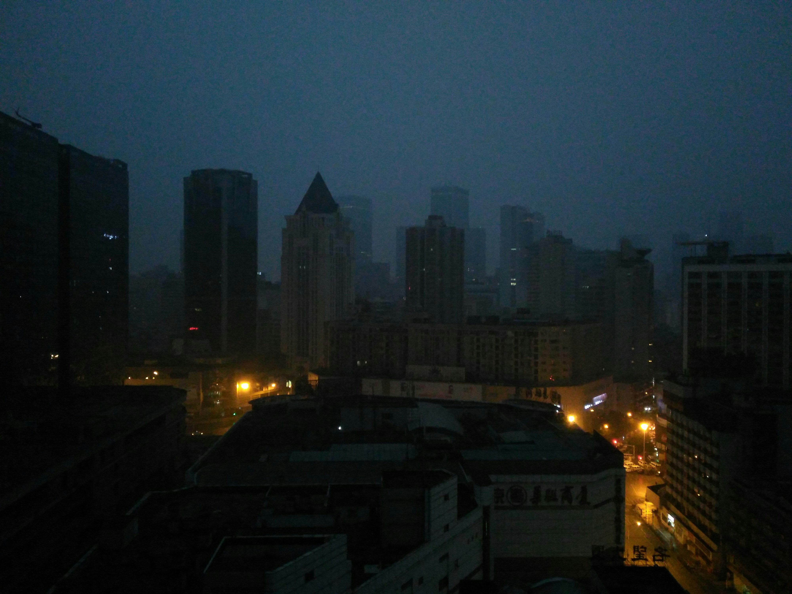
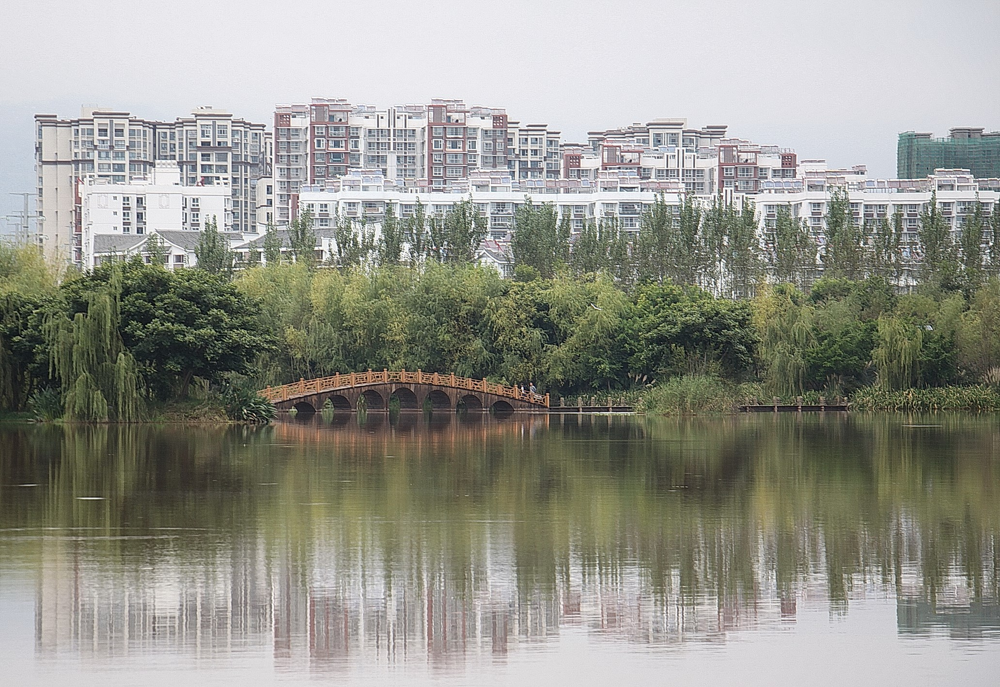
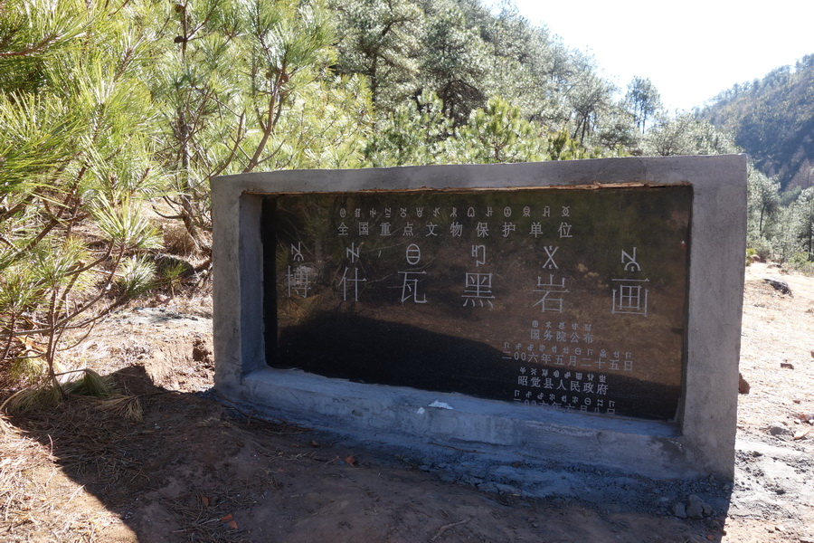
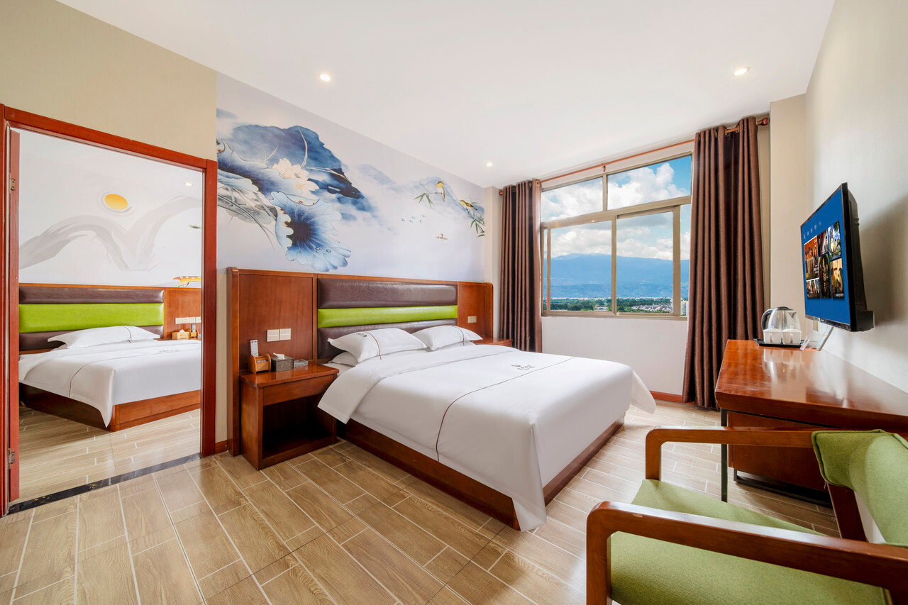
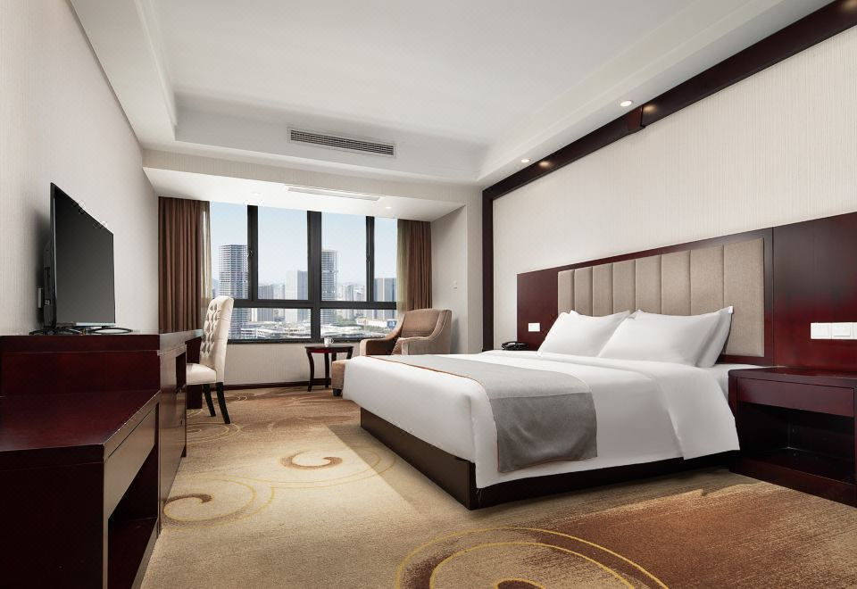

# 涼山旅行の持ち物チェックリスト

対象旅程は 2026年3月19日(木) から 2026年3月22日(日) です。  
今回は `成都 -> 西昌 -> 昭覚 -> 成都 -> 杭州` と動くので、服は「成都・杭州の春」と「昭覚の朝晩の冷え込み」の両方に合わせるのが正解です。

## まず結論

- 一番大事なのは `脱ぎ着しやすい重ね着`
- 萌子向けの正解は `日本の真冬フル装備` ではなく `春服 + 朝晩だけ軽ダウン`
- 昭覚は「山中の何もない秘境」ではなく、`県城のホテルに泊まる地方滞在` のイメージ
- ただし昭覚は標高が高く、`最低気温 0 - 1℃前後` まで落ちる見込みなので、朝晩だけはしっかり防寒が必要

## 各地の雰囲気と服装の目安

### 成都 3月19日(木) 夜 / 3月21日(土) 夕方乗継

- 予報目安: `3/19 16.3℃ / 9.6℃`, `3/21 16.5℃ / 12.0℃`
- 体感: 大阪や福岡の `春先の少しひんやりする日` に近い
- 日本でいうと: `福岡市 - 名古屋市クラスの大都市圏`
- 推奨コーデ:
  - 日中は `長袖 + 薄手アウター`
  - 夜の空港移動は `薄手ダウン or 防風シェル` があると快適
  - 足元は `歩きやすいスニーカー` で十分
- 服の厚さメモ: `厚手コート不要 / 春アウターで十分`

### 西昌 3月20日(金) 日中

- 予報目安: `3/20 19.4℃ / 8.9℃`
- 体感: `晴れた日の松山・甲府・熊本` みたいに、昼はかなり動きやすい
- 日本でいうと: `地方中核都市`
- 推奨コーデ:
  - `長袖Tシャツ or 薄手ニット`
  - 上に `シャツジャケット or 薄手ブルゾン`
  - 昭覚へ向かうので、脱いだり着たりしやすい服が便利
- 服の厚さメモ: `昼は春服`, `朝は薄手アウター`

### 昭覚 3月20日(金) 夜 - 3月21日(土) 朝

- 予報目安: `3/20 9.1℃ / 0.6℃`, `3/21 16.1℃ / 0.6℃`
- 体感: `長野や飛騨の春先の朝晩` に近い
- 日本でいうと: `山間部の小さな地方都市・県庁所在地の中心街` くらい
- 勘違いしないための一言:
  - `完全な山奥キャンプ` ではない
  - `ホテル・食堂・車移動中心の地方滞在` なので、街歩き用の普通の服で大丈夫
  - ただし `標高約2600m` なので、朝晩の冷え込みだけは都会感覚より強い
- 推奨コーデ:
  - 日中: `長袖 + 羽織り`
  - 朝晩: `薄手インナー + ニット or フリース + 軽ダウン or 防風シェル`
  - 下は `普通の長ズボン` で十分。厚手タイツ必須ではないが、寒がりならあると安心
- 服の厚さメモ: `真冬コートまでは不要`, `軽ダウン級は必要`

### 杭州 3月21日(土) 深夜 - 3月22日(日) 朝

- 予報目安: `3/21 16.8℃ / 7.4℃`, `3/22 16.2℃ / 11.2℃`
- 体感: `雨のある横浜・千葉の春先`
- 日本でいうと: `大都市の空港近郊エリア`
- 推奨コーデ:
  - 深夜着は `春アウター`
  - 早朝空港移動は `薄手ダウン or しっかりめカーディガン`
  - 空港近くなので、街中おしゃれ全振りより `移動しやすさ優先` が正解
- 服の厚さメモ: `春コート相当`

## ホテルごとの設備メモ

### 3月19日 成都

- 宿: 海榕旎嘉ホテル（成都世紀城新国際会議展覧センター）
- 予約画面で確認できた設備:
  - `手荷物預かり`
  - `公共駐車場`
  - `電気自動車充電スタンド`
- Web掲載で確認できたもの:
  - `Wi-Fi`
- 持参判断:
  - `歯ブラシ・基礎化粧品・最低限の洗面用品は持参` が安全
  - 部屋着は軽いものが1つあると安心

### 3月20日 昭覚

- 宿: 昭覚途悅ホテル
- 予約画面で確認できた設備:
  - `手荷物預かり`
  - `モーニングコール`
  - `公共駐車場`
- Web掲載で確認できたもの:
  - `Wi-Fi`
- 持参判断:
  - 山側で冷えるので `部屋着兼インナー1枚` があると便利
  - アメニティ詳細は十分に確認できなかったので、`歯ブラシ・スキンケア・常備薬は必携`

### 3月21日 杭州

- 宿: 靖江ホテル（杭州蕭山空港永盛路地下鉄駅）
- 予約画面で確認できた設備:
  - `優先片道送迎（空港発）`
  - `空港シャトル（空港行）`
  - `手荷物預かり`
- Web掲載で確認できたもの:
  - `Wi-Fi`
- 持参判断:
  - 空港送迎が使える前提なら、大きな荷物を抱えて深夜移動する負担は軽め
  - ただし洗面アメニティの詳細確認は不十分なので、`歯ブラシ・基礎化粧品は持参`

## 服の最適解

- [x] 長袖トップス 2 - 3枚
- [x] 薄手インナー 2枚
- [x] 羽織りもの 1枚
- [x] ウルトラライトダウン
- [x] 普通の長ズボン 1 - 2本
- [x] 下着 3日分
- [x] 靴下 3日分
- [ ] 歩きやすいスニーカー
- [ ] 折りたたみ傘

### 萌子向けのおすすめ組み合わせ

- `移動日`: 長袖 + 羽織り + 軽ダウン
- `西昌の日中`: 長袖 + 羽織り
- `昭覚の朝晩`: 薄手インナー + 長袖 + 軽ダウン
- `杭州の早朝`: 長袖 + 春アウター

## あなた向け

- [x] パスポート
- [x] 航空券・列車・ホテル予約控えの控え
- [x] 財布
- [x] スマホ
- [x] wax
- [x] コンタクトの洗浄液
- [x] コンタクトの予備
- [x] 髭剃り
- [x] 点鼻薬*3
- [x] 充電アダプタ
- [x] lightening long
- [x] type c
- [x] モバイルバッテリー
- [x] 変換プラグ
- [x] 中国で使う決済手段
- [x] 常備薬
- [x] ティッシュ
- [x] ウェットティッシュ
- [x] 歯ブラシ
- [ ] 小さめ洗面セット
- [x] 長袖トップス
- [ ] 薄手インナー
- [ ] 羽織りもの
- [x] `軽ダウン or 防風シェル`
- [ ] 歩きやすい靴

## 彼女向け

- [ ] パスポート
- [ ] 航空券・列車・ホテル予約控えの控え
- [ ] スマホ
- [ ] 充電器
- [ ] ケーブル
- [ ] モバイルバッテリー
- [ ] 財布
- [ ] 中国で使う決済手段
- [ ] 常備薬
- [ ] ティッシュ
- [ ] ウェットティッシュ
- [ ] 歯ブラシ
- [ ] クレンジング
- [ ] スキンケア最小セット
- [ ] 保湿剤
- [ ] 日焼け止め
- [ ] リップクリーム
- [ ] ヘアゴム
- [ ] ヘアブラシ or くし
- [ ] 生理用品
- [ ] 長袖トップス 2 - 3枚
- [ ] 薄手インナー 2枚
- [ ] 羽織りもの 1枚
- [ ] `軽ダウン or 防風シェル` 1枚
- [ ] 普通の長ズボン
- [ ] 部屋着
- [ ] 歩きやすい靴
- [ ] 必要なら軽いメイク道具

## 2人でどちらかが持てばよいもの

- [ ] 予約控えのバックアップ一式
- [ ] SIM / eSIM の控え情報
- [ ] 香港SIM / 香港eSIM の開通情報
- [ ] 小型爪切り
- [ ] ばんそうこう
- [ ] 解熱鎮痛薬
- [ ] 胃腸薬
- [ ] 洗濯ネット
- [ ] ビニール袋
- [ ] 折りたたみ傘 1本

## 今回は減らせそうなもの

- [ ] 厚手の冬コート
- [ ] かさばるニットを何枚も
- [ ] 重いPC
- [ ] 大きい洗面用品フルセット

## ホテルを踏まえた最終判断

- `歯ブラシ`: 3ホテルとも部屋アメニティの確証が弱いので持つ
- `スキンケア`: 持つ
- `スリッパ`: 必須ではない
- `タオル`: ホテル泊なので持たなくてよい
- `ドライヤー`: 基本ホテル前提で持たなくてよい
- `厚手防寒着`: 不要
- `軽ダウン or 防風シェル`: 必須寄り

## 情報源

- 気温予報: [Open-Meteo Chengdu](https://api.open-meteo.com/v1/forecast?latitude=30.66667&longitude=104.06667&daily=temperature_2m_max,temperature_2m_min,precipitation_probability_max,weather_code&timezone=Asia%2FShanghai&forecast_days=7), [Open-Meteo Xichang](https://api.open-meteo.com/v1/forecast?latitude=27.89642&longitude=102.26341&daily=temperature_2m_max,temperature_2m_min,precipitation_probability_max,weather_code&timezone=Asia%2FShanghai&forecast_days=7), [Open-Meteo Zhaojue area](https://api.open-meteo.com/v1/forecast?latitude=28.06&longitude=102.83&daily=temperature_2m_max,temperature_2m_min,precipitation_probability_max,weather_code&timezone=Asia%2FShanghai&forecast_days=7), [Open-Meteo Hangzhou](https://api.open-meteo.com/v1/forecast?latitude=30.29365&longitude=120.16142&daily=temperature_2m_max,temperature_2m_min,precipitation_probability_max,weather_code&timezone=Asia%2FShanghai&forecast_days=7)
- ホテル情報: [海榕旎嘉ホテル](https://jp.trip.com/hotels/chengdu-hotel-detail-121078296/hai-rong-ni-jia-jiu-dian/), [昭覚途悅ホテル](https://jp.trip.com/hotels/zhaojiao-hotel-detail-29833714/zhao-jue-tu-yue-jiu-dian/), [靖江ホテル](https://jp.trip.com/hotels/hangzhou-hotel-detail-8670135/jingjiang-hotel/)
- 参考写真: [成都 Wikimedia Commons](https://commons.wikimedia.org/wiki/File:Central_Chengdu_skyline_at_dawn_-_Flickr.jpg), [西昌 Wikimedia Commons](https://commons.wikimedia.org/wiki/File:00_Xichang_Qionghai_Lake.jpg), [昭覚 Wikimedia Commons](https://commons.wikimedia.org/wiki/File:%E5%8D%9A%E4%BB%80%E7%93%A6%E9%BB%91%E5%B2%A9%E7%94%BB%E5%9B%BD%E4%BF%9D%E7%A2%91.jpg), [杭州 Wikimedia Commons](https://commons.wikimedia.org/wiki/File:20090524_Hangzhou_West_Lake_7531.jpg)
