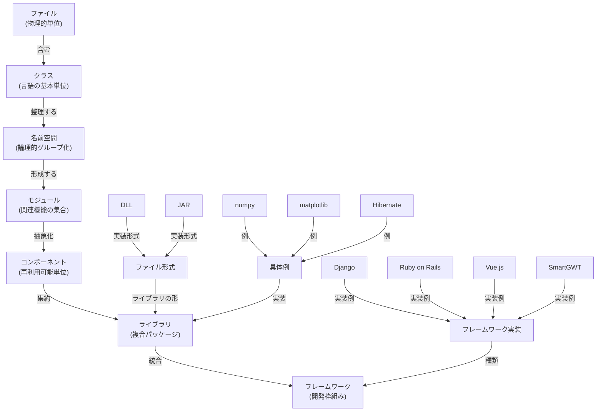

# プログラミング用語の関係性分析

## 概要

以下の用語について、包含関係と意味を整理します。これらはソフトウェア開発における異なる階層の概念です。

---

## 1. 階層構造

### 最小単位：ファイル
- **定義**：ディスク上に保存されたテキストやバイナリデータの単位
- **役割**：コードやリソースを保存する物理的な格納先

### クラス
- **定義**：オブジェクト指向プログラミングにおけるコードの基本単位
- **性質**：1つのファイルに複数のクラスが含まれることが多い
- **例**：JavaやPythonにおけるクラス定義

### 名前空間（Namespace）
- **定義**：クラスや関数を論理的にグループ化するための組織概念
- **目的**：名前の競合を避け、コードの整理性を向上させる
- **言語例**：JavaScriptモジュール、Pythonの`__init__.py`など

### モジュール
- **定義**：関連する機能をまとめた再利用可能なコード単位
- **実装形態**：1つまたは複数のファイルで構成される
- **例**：JavaのPackage、Pythonの`.py`ファイル、RubyのModule

### コンポーネント
- **定義**：モジュールよりも高い抽象度で、独立した再利用可能な機能単位
- **特徴**：入出力が明確に定義されており、他のコンポーネントと組み合わせやすい
- **例**：UIコンポーネント（Vue.jsのコンポーネント）、業務ロジックコンポーネント

### ライブラリ
- **定義**：複数のモジュール・コンポーネントを集めた機能提供パッケージ
- **性質**：他のプログラムから利用されることを前提に設計
- **例**：numpy、matplotlib、Java標準ライブラリ

---

## 2. ライブラリの具体形式

### DLL（Dynamic Link Library）
- **対象OS**：Windows
- **形式**：`*.dll`ファイル
- **用途**：Cやその他の言語で書かれた再利用可能な機能を提供
- **動作**：実行時に動的にリンクされる

### JAR（Java Archive）
- **対象言語**：Java
- **形式**：`*.jar`ファイル（実はZIP形式）
- **内容**：コンパイル済みクラス、リソース、メタデータを含む
- **用途**：Javaライブラリやアプリケーション配布の標準形式

---

## 3. フレームワーク

### 定義
- **説明**：アプリケーション開発の枠組み・骨組み
- **特徴**：モジュール・ライブラリの組み合わせで構成される統合環境
- **役割**：開発者が従うべき設計パターンと実装ガイドを提供

### 代表例

| フレームワーク | 言語 | 用途 |
|---|---|---|
| Ruby on Rails | Ruby | Web開発（MVC） |
| Django | Python | Web開発（MVC） |
| Vue.js | JavaScript | フロントエンド開発 |
| SmartGWT | Java/JavaScript | UI開発（GWT） |

---

## 4. ライブラリの具体例

### numpy
- **言語**：Python
- **用途**：数値計算・行列演算
- **特徴**：Pythonの科学計算エコシステムの基盤

### matplotlib
- **言語**：Python
- **用途**：データ可視化（グラフ・図表作成）
- **関係**：numpyと連携して使用されることが多い

### Hibernate
- **言語**：Java
- **用途**：ORM（Object-Relational Mapping）ツール
- **機能**：オブジェクトをデータベースに永続化

---

## 5. その他の重要概念

### デプロイ（Deploy）
- **定義**：開発環境で作成したアプリケーションを本番環境に配置・実行する行為
- **プロセス**：ビルド → テスト → デプロイ → 運用
- **関連**：JAR、DLLなどはデプロイの対象物

### Mermaid
- **分類**：図式化ツール（用語ではなくツール）
- **用途**：Markdownから図表を生成
- **例**：このファイルの関係図として使用

---

## 6. 包含関係の図式化



---

## 7. 関係性の要約

| 階層 | 概念 | 説明 | 具体例 |
|---|---|---|---|
| 1 | ファイル | 物理的な保存単位 | `User.py` |
| 2 | クラス | OOP基本単位 | `class User:` |
| 3 | 名前空間 | 論理的グループ化 | `models` パッケージ |
| 4 | モジュール | 機能の集合 | `models.py` |
| 5 | コンポーネント | 再利用可能な単位 | 認証コンポーネント |
| 6 | ライブラリ | 配布可能なパッケージ | `numpy`、`django` |
| 7 | フレームワーク | 統合開発環境 | `Ruby on Rails` |

---

## 8. デプロイの文脈での位置付け


---

## 9. 設計哲学：マトリョーシカの誕生理由

プロフェッショナルアーキテクトの視点から、各階層がなぜ生まれ、なぜ異なる名前を持つのかを説明します。これは **ソフトウェア複雑性との戦い** の歴史です。

### 階層1：ファイル（1960-1970年代の課題）

**問題**：ストレージが有限。メモリも少ない。
- コンピュータの物理的制約：一度に全コードをメモリに読めない
- ディスク管理：どのように情報を保存、読み込むか

**解決**：ファイルシステム
- データを離散的に分割して保存
- 必要な時だけメモリに読み込める
- 名前：「ファイル」= 物理的な保存単位の最小形態

---

### 階層2：クラス（1980-1990年代の課題）

**問題**：手続き型プログラミングの限界
- コード行数が数千行を超えると、保守困難に
- データとそれを操作する関数の関係が曖昧
- 「どの関数がどのデータを使うのか」を追跡不可能

**解決**：オブジェクト指向プログラミング
- データ（属性）と操作（メソッド）を一つにカプセル化
- 責任の明確化：「このクラスは何を管理する責任があるか」
- 名前：「クラス」= 設計図、青写真の意味。型の定義

---

### 階層3：名前空間（1990-2000年代の課題）

**問題**：複数チーム、複数プロジェクト
- 異なるチームが同じ名前のクラスを作成（例：全員が`User`クラスを作成）
- 名前の衝突 → コンパイルエラー、バグ
- 「どの`User`クラスなのか」の曖昧性

**解決**：名前空間による名前の修飾
- `accounting.User`、`crm.User` というように前置詞を付ける
- 責任分離：「auth領域」「payment領域」を明確化
- 名前：「名前空間」= 名前の文脈を区切る空間の意味

---

### 階層4：モジュール（2000年代の課題）

**問題**：プロジェクト規模の指数関数的増大
- 名前空間だけでは不十分
- 関連するクラスの束を「一つの単位」として管理したい
- 「支払い処理」「認証」「ログ」など、概念的に関連する機能をまとめたい

**解決**：モジュールの誕生
- 複数のクラスを機能ごとにグループ化
- ファイル単位で管理可能（`payment_module.py`）
- チーム単位での責任分離：「Aチームは認証モジュール担当」
- 名前：「モジュール」= 取り外し可能な部品の意味。他の機械との組み立て

---

### 階層5：コンポーネント（2010年代の課題）

**問題**：モジュールだけでは足りない
- UI部品、ビジネスロジック、データアクセス層が混在
- 「特定の機能を他のプロジェクトで再利用したい」が実現困難
- 依存関係が複雑に絡み合う

**解決**：コンポーネント設計
- **入力と出力を明確に定義**：何を入力として受け取り、何を出力するか
- **内部実装を隠蔽**：「どのクラスで実装されているか」を利用者は知らない
- **自己完結性**：そのコンポーネントだけで独立して動作可能
- 名前：「コンポーネント」= 電子部品、ユニット。内部構造を知らずに使える

---

### 階層6：ライブラリ（2010年代以降の課題）

**問題**：コンポーネント化しても、配布と再利用が難しい
- 「このコンポーネントを他の企業のプロジェクトで使いたい」
- バージョン管理、依存関係の管理
- ライセンス、ドキュメント、サポート

**解決**：ライブラリとしてのパッケージング
- コンポーネントを `pip install`、`npm install` で配布可能に
- バージョン管理の仕組み（numpy 1.20.0 と 2.0.0 の互換性）
- 標準化されたメタデータ（作成者、ライセンス、依存関係）
- 名前：「ライブラリ」= 図書館。必要な本を借りる感覚で機能を利用

---

### 階層7：フレームワーク（2000年代後半以降の課題）

**問題**：ライブラリが多すぎて、統一性がない
- Web開発には「ルーティング」「テンプレートエンジン」「DBアクセス」が必要
- 異なるライブラリを組み合わせると、設計がバラバラ
- 「初心者はどれを選べばいい？」「チーム内で基準がない」

**解決**：フレームワークによる統一と規格化
- 必要なコンポーネント・ライブラリを **統合パッケージ** として提供
- **ベストプラクティスの強制**：MVC、DDD などの設計パターンを組み込む
- **プロジェクト生成の自動化**：`rails generate` で自動的に正しい構造を生成
- 名前：「フレームワーク」= 建築の枠組み。型に沿うことで堅牢性を確保

---

## 10. マトリョーシカが生まれた根本的な理由

各階層が異なる名前を持つ理由は、**解決する課題が異なる** からです：

| 階層 | 解決する課題 | アーキテクチャの目的 |
|---|---|---|
| **ファイル** | 物理的ストレージの有限性 | スケーラビリティ |
| **クラス** | 手続き型の複雑性 | 保守性・設計の明確性 |
| **名前空間** | チーム規模の拡大 | 名前衝突の回避 |
| **モジュール** | 機能の独立管理 | チームの責任分離 |
| **コンポーネント** | 再利用性の向上 | 開発効率 |
| **ライブラリ** | 再利用の標準化 | 配布・管理の効率化 |
| **フレームワーク** | 大規模開発の統一 | ガバナンス・品質保証 |

### マトリョーシカの本質

```
問題の規模が大きくなる
  ↓
新しい抽象レベルが必要になる
  ↓
新しい概念が誕生する（新しい名前を付ける）
  ↓
新しい層が加わる
```

**なぜ名前を分けるのか？**

プログラマが異なる **レベルの思考** をする必要があるから：
- ファイルについて考える時：「このファイルは何を責務とするのか」
- クラスについて考える時：「どのデータと操作をカプセル化するか」
- モジュールについて考える時：「チーム内での責任分離はどうするか」
- ライブラリについて考える時：「外部開発者が容易に使用できるか」
- フレームワークについて考える時：「全社的な開発基準はどうあるべきか」

名前は **思考レベルの切り替え** を示しているのです。

---

## 11. 実践的な観点：なぜアーキテクトはこれを理解すべきか

1. **スケーリングの判断**：チーム規模が10人から100人になった時、どの層を強化すべきか判断できる
2. **技術選定の根拠**：「なぜDjangoなのか、素のPythonモジュールではダメなのか」を説明できる
3. **リファクタリングの優先順位**：「クラス設計を直すべきか、モジュール設計を直すべきか」を判定できる
4. **チーム構成の最適化**：各層に対応する組織構造を設計できる
5. **技術債の分類**：「ファイル構成の問題か、コンポーネント設計の問題か」を区別できる

---

## 結論

マトリョーシカの各層は、**ソフトウェア開発が直面する歴史的課題に対する解決策** です。

- 名前が異なるのは、解決する課題が異なるから
- 階層が増えるのは、複雑性が指数関数的に増すから
- アーキテクトはこの階層を理解することで、**正しいレベルで問題を解決** できます

このマトリョーシカは、50年のソフトウェア開発の知恵が凝縮されたものなのです。
