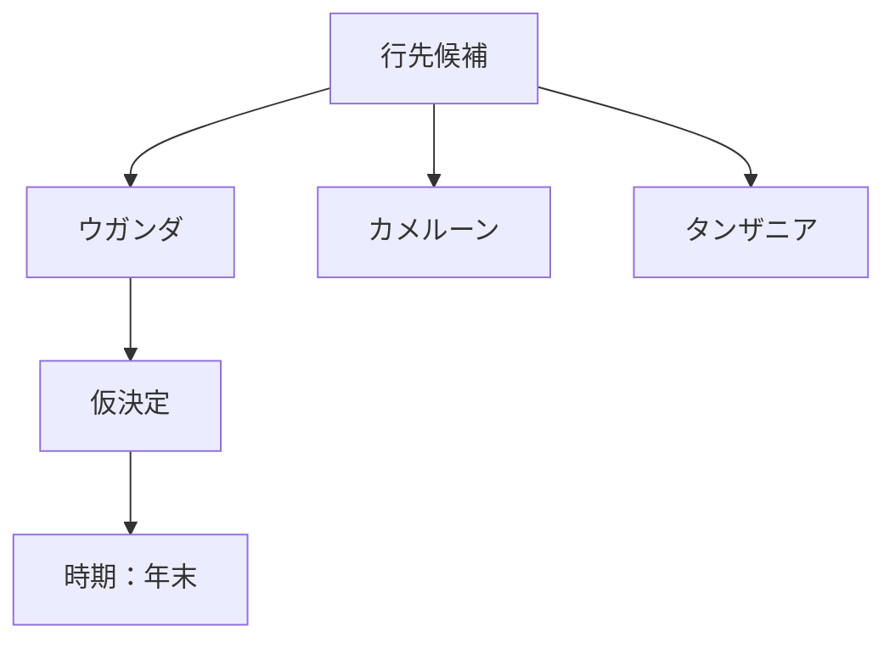

了解。**コンパクトなメモ**として更新します。
（以降、この形式で追記・更新していきます）

---

## 年末アフリカ・ハナムグリ採集遠征｜進捗メモ

### 決定事項（暫定含む）

### テキストメモ

* 行先候補

  * ウガンダ
  * カメルーン
  * タンザニア

* 現状

  * **ウガンダ：仮決定**
  * **時期：年末**

次、会話で確定したら

* 国の変更
* 地域（例：森林名・都市名）
* 移動手段
  などをそのまま言ってください。
  **図と箇条書きだけを最小更新**していきます。

---

### 受領メモ（追記）

* 行先の候補：ウガンダ、カメルーン、タンザニア

* 仮決定：ウガンダ
  * 日付：年末

* 航空運賃（現状メモ）
  * ウガンダ・カメルーン共にドバイ経由が安そう
  * ドバイ→ウガンダ：おおよそ6万円
  * ドバイ→カメルーン：おおよそ10万円
  * ただし、ドバイまでの航空券は現在高騰しているため保留

* 現地行程（ウガンダ想定）
  * 主要候補地：キバレ国立公園（Kibale National Park）が有力
  * ガイド：公園内で手配可能（現地で捕まえる）
  * 事前連絡しておき、甲虫採集に詳しいガイドか確認できればベター

* レンタカー・移動手段要調査項目
  * レンタカーを借りられるか（4WDの可否）
  * 道路状況や運転の難易度（運転は難しくないか）
  * ガソリンスタンドや保険（LDW/TP等）の有無

* 次アクション候補
  * 主要航空路（ドバイ経由）での最安チケットの概算を継続確認
  * キバレ国立公園周辺の宿泊・ガイド手配先を調査
  * レンタカー業者（4WD可否）をリストアップ

