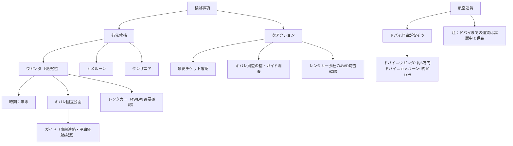

---

### 図（要点）

### 話すべき項目（チェックリスト）

- 航空：ルート（ドバイ経由含む）、日程、概算費用
- 宿泊：キバレ周辺の候補、予算、立地
- ガイド：甲虫採集経験、事前連絡先、料金・集合場所
- レンタカー：4WD可否、保険（LDW/TP）、ピックアップ場所
- 道路状況：舗装状況、移動時間、夜間運転の可否
- 許可・手続き：採集・標本の採取許可、輸出入手続き
- ワクチン・ビザ：必要な予防接種、ビザ取得情報
- 装備：採集道具、保存用資材、電源（モバイルバッテリー）
- 予算：概算見積り、予備費
- 安全：緊急連絡先、保険、治安情報
- 現地通信：SIM、インターネット状況
- 研究目的／質問：ガイドに聞くべきポイント（最良採集地、最適時間帯、ライトトラップの可否）

この図で「話すべき項目」は網羅されていますか？追加や優先順位の要望があれば教えてください。
