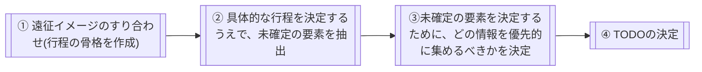
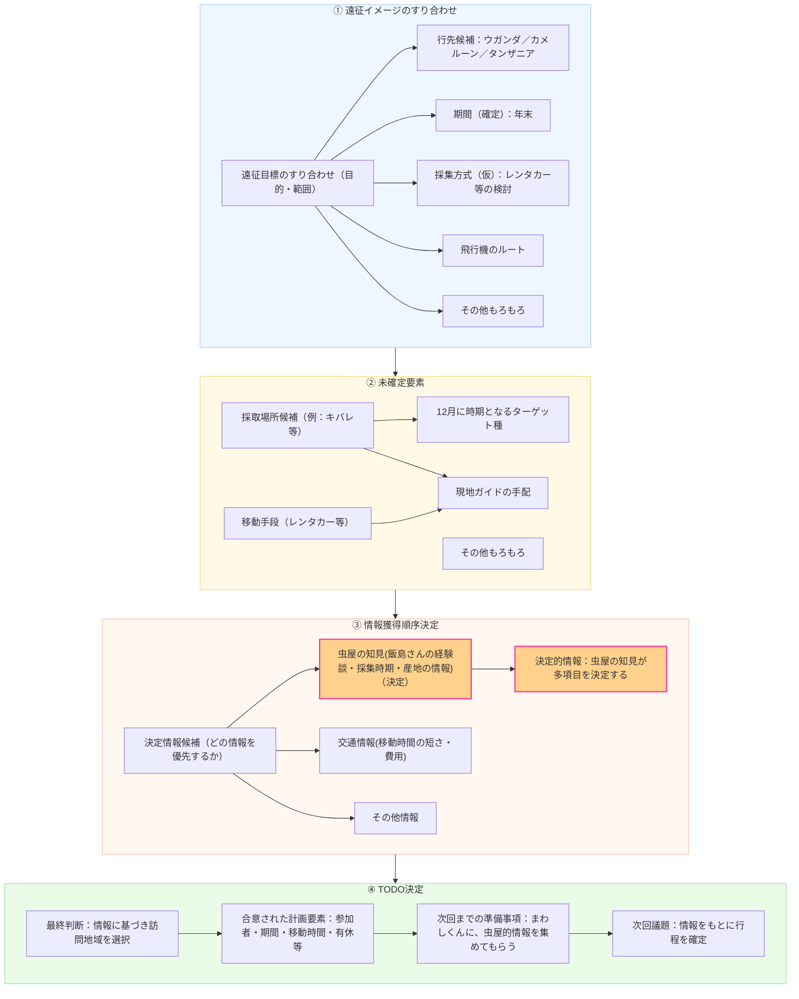

```mermaid
graph LR
  M1[["① 遠征イメージのすり合わせ(行程の骨格を作成)"]]
  M2[["② 具体的な行程を決定するうえで、未確定の要素を抽出"]]
  M3[["③未確定の要素を決定するために、どの情報を優先的に集めるべきかを決定"]]
  M4[["④ TODOの決定"]]
  M1 --> M2 --> M3　--> M4
```

```mermaid
graph TD
  %% Reconstructed as four sequential flows (M1..M4)
  subgraph F1["① 遠征イメージのすり合わせ"]
    F1_Goals["遠征目標のすり合わせ（目的・範囲）"]
    F1_G1["行先候補：ウガンダ／カメルーン／タンザニア"]
    F1_G2["期間（確定）：年末"]
    F1_G3["採集方式（仮）：レンタカー等の検討"]
    F1_G4["飛行機のルート"]
    F1_G5["その他もろもろ"]
    F1_Goals --> F1_G1
    F1_Goals --> F1_G2
    F1_Goals --> F1_G3
    F1_Goals --> F1_G4
    F1_Goals --> F1_G5
  end

  subgraph F2["② 未確定要素"]
    F2_Place["採取場所候補（例：キバレ等）"]
    F2_Timing["12月に時期となるターゲット種"]
    F2_Transport["移動手段（レンタカー等）"]
    F2_Guide["現地ガイドの手配"]
    F2_Other["その他もろもろ"]
    F2_Place --> F2_Timing
    F2_Place --> F2_Guide
    F2_Transport --> F2_Guide
  end

  subgraph F3["③ 情報獲得順序決定"]
    F3_DecideInfo["決定情報候補（どの情報を優先するか）"]
    F3_Info["虫屋の知見(飯島さんの経験談・採集時期・産地の情報)（決定）"]
    F3_Cost["交通情報(移動時間の短さ・費用)"]
    F3_Other["その他情報"]
    F3_DecideInfo --> F3_Info
    F3_DecideInfo --> F3_Cost
    F3_DecideInfo --> F3_Other
    F3_Info --> F3_Decisive["決定的情報：虫屋の知見が多項目を決定する"]
  end

  subgraph F4["④ TODO決定"]
    F4_Decide["最終判断：情報に基づき訪問地域を選択"]
    F4_Items["合意された計画要素：参加者・期間・移動時間・有休等"]
    F4_Todo["次回までの準備事項：まわしくんに、虫屋的情報を集めてもらう"]
    F4_Next["次回議題：情報をもとに行程を確定"]
    F4_Decide --> F4_Items --> F4_Todo--> F4_Next
  end

  %% Emphasize the decided information node
  classDef decided fill:#ffd18c,stroke:#f39,stroke-width:2;
  class F3_Info decided;
  class F3_Decisive decided;

  %% sequence across the four flows
  F1 --> F2 --> F3 --> F4

  style F1 fill:#eef7ff,stroke:#9fc6ff
  style F2 fill:#fff9e6,stroke:#f7d26f
  style F3 fill:#fff7f0,stroke:#f7b78f
  style F4 fill:#eafbe8,stroke:#8fe08f
```
