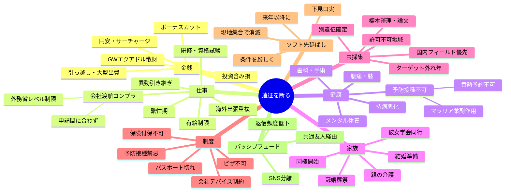

# 危険人物フォロワーからの遠征同行を断るロジック整理

作成日: 2026-05-18

## 背景

- 対象: お盆休みの南アジア遠征 / 冬休みのアフリカ遠征
- リスク: 暴力性・衝動性が高く、現地でのトラブル（逮捕・襲撃）懸念
- 制約: 真っ向から敵対すると税関での通報リスクなど報復行為のおそれ
- 方針: 「敵対せず、自然に距離を取れる」断りロジックを多角的に列挙

---

## 1. ロジックノード（カテゴリ別ツリー）

### A. 金銭ロジック（最も「敵を作らない」王道）
- A1. GWエクアドル遠征で予算枯渇
  - A1-1. クレカ請求が想定超過
  - A1-2. 来年度の遠征積立を切り崩したので補填が必要
- A2. 円安・燃油サーチャージ高騰で渡航コスト増
- A3. 会社の業績悪化でボーナスカット見込み
- A4. 大型ライフイベント支出
  - A4-1. 引っ越し費用
  - A4-2. 車・バイクの買い替え
  - A4-3. 機材（カメラ・撮影機材・標本箱）への大型投資
- A5. 投資ポートフォリオの含み損で現金化できず

### B. 仕事ロジック（会社都合は最強の不可抗力）
- B1. プロジェクト繁忙期で長期休暇取得不可
- B2. 海外出張と日程が重なる
- B3. 会社の渡航許可制度（コンプラ）で当該国がNG
  - B3-1. 外務省レベル2以上の地域は社内禁止
  - B3-2. 渡航前申請が必要で日程的に間に合わない
- B4. 異動・昇格に伴う引き継ぎ業務
- B5. 業務命令の研修・資格試験と日程衝突
- B6. 上司から有給連続取得を制限された

### C. 健康ロジック（プライベートで突っ込まれにくい）
- C1. 持病の悪化で医師から長期渡航を止められた
- C2. 予防接種スケジュールが間に合わない
  - C2-1. 黄熱ワクチンの予約が取れない
  - C2-2. 抗マラリア薬で副作用が出た
- C3. 高地・長距離歩行不可（腰痛・膝）
- C4. メンタル不調で休養が必要
- C5. 歯科治療・手術を控えている

### D. 家族・人間関係ロジック
- D1. 親の体調不良で介護・通院付き添い
- D2. 彼女（京大ポスドク）との結婚準備・両家挨拶
- D3. 同棲開始・新居準備で休暇を使い切る
- D4. 親族の冠婚葬祭が同時期に複数
- D5. 彼女の海外学会同行が決まった

### E. 虫採集ロジック（同じ趣味の相手に最も自然）
- E1. 既に別グループでの遠征が確定済み
  - E1-1. 別の信頼できる同行者と契約済みでキャンセル不可
- E2. ターゲット種の発生時期が今年はズレている
  - E2-1. 現地コレクターから「今年は外れ年」と情報
- E3. 採集許可・輸出許可が下りない地域に変更
- E4. 自分のメインフィールド（国内）を優先する年にした
- E5. 標本整理・論文投稿で在宅期間が必要

### F. 制度・物理的制約ロジック（争えない事実）
- F1. パスポート残存期間不足・更新申請中
- F2. ビザ取得が間に合わない / 個人手配で却下
- F3. 必要な予防接種に医学的禁忌
- F4. 海外旅行保険が当該地域で付保できない
- F5. 会社支給スマホ・PCの持ち出し制限

### G. ソフト先延ばしロジック（決裂回避の緩衝材）
- G1. 「今年は無理だけど来年以降に」と時期をずらす
- G2. 「短期日程なら検討」と条件を厳しくして自然消滅狙い
- G3. 「別ルートで合流」と現地集合を匂わせて結局行かない
- G4. 「下見が必要」と称して別の年にずらす

### H. パッシブフェード（最終手段）
- H1. SNSの遠征アカウントを別運用に切替
- H2. 共通の友人経由でのみ情報を流す
- H3. 既読遅延・返信頻度低下で自然にフェードアウト

---

## 2. マインドマップ（Mermaid）

---

## 3. 戦略マトリクス（説得力 × 敵対リスク）

| ロジック | 説得力 | 敵対リスク | 推奨度 | 備考 |
|---|---|---|---|---|
| A. 金銭 | 高 | 低 | ◎ | 「金がない」は最も角が立たない |
| B. 仕事 | 高 | 低 | ◎ | 不可抗力として処理されやすい |
| C. 健康 | 中 | 低 | ○ | 詳細を突っ込まれにくい |
| D. 家族 | 高 | 低 | ◎ | 彼女・親の話は深掘りされにくい |
| E. 虫採集 | 中 | 中 | △ | 同じ趣味なので情報共有要注意 |
| F. 制度 | 高 | 低 | ◎ | 事実ベースで反論不可 |
| G. 先延ばし | 中 | 中 | ○ | 緩衝材として併用 |
| H. フェード | 低 | 中 | △ | 最終手段、関係維持優先なら不要 |

---

## 4. オーストラリア組の友人への壁打ち論点

1. **複数ロジックの併用が自然か**: 例「仕事 + 金銭 + 彼女」の三段重ね
2. **どのロジックなら相手が一番納得しそうか**: 相手の価値観（金 / 仕事 / 女）どこに弱い？
3. **来年以降の関係をどうしたいか**: 完全フェード or 緩い距離維持
4. **共通の虫仲間コミュニティへの説明統一**: 言い訳の整合性
5. **税関リスクの現実性評価**: 本当に通報されうるレベルの人物か？
6. **第三者（友人）から相手に間接的に伝えてもらう案の是非**

---

## 5. 推奨アプローチ（暫定案）

**メイン**: B（仕事）+ A（金銭）の二段構え
- 「夏は会社の渡航コンプラで南アジアが申請通らなかった」
- 「冬はGWで使いすぎて来年度に積立直す必要がある」

**保険**: D（家族）を後付け
- 「彼女との結婚準備もあり長期休暇を取りづらい」

**回避策**: 別の遠征計画を匂わせない
- E（虫採集）ロジックは情報が漏れて矛盾するリスクあり、極力使わない

**長期方針**: G1（来年以降に）で関係を即時破綻させず緩衝、徐々にH（フェード）へ移行
